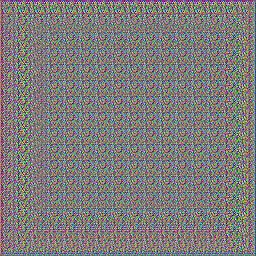
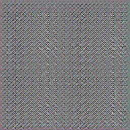
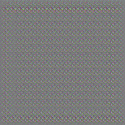
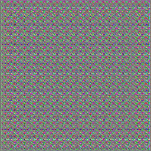
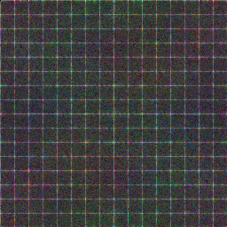
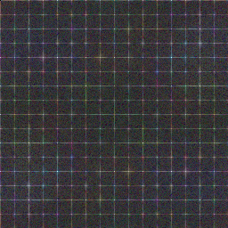
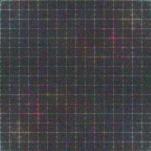
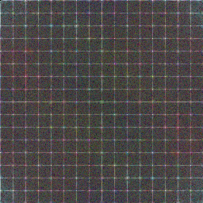

<h1 align="center">Deep Image Fingerprint: Towards Low Budget Synthetic Image Detection and
Model Lineage Analysis</h1> 

<p align="center"> <a href="https://www.linkedin.com/in/serge2020/">Sergey Sinitsa</a> &nbsp;&nbsp;&nbsp;&nbsp;&nbsp;&nbsp; <a href="https://www.ohadf.com/">Ohad Fried</a>

<p align="center"><a href="https://arxiv.org/abs/2303.10762">arXiv</a> &nbsp;&nbsp;&nbsp;&nbsp;&nbsp;&nbsp; <a href="https://sergo2020.github.io/DIF/">Project Page</a> </p>

> The generation of high-quality images has become
> widely accessible and is a rapidly evolving process. As a
> result, anyone can generate images that are indistinguishable
> from real ones. This leads to a wide range of applications,
> including malicious usage with deceptive intentions.
> Despite advances in detection techniques for generated images,
> a robust detection method still eludes us. Furthermore,
> model personalization techniques might affect the detection
> capabilities of existing methods. In this work, we
> utilize the architectural properties of convolutional neural
> networks (CNNs) to develop a new detection method. Our
> method can detect images from a known generative model
> and enable us to establish relationships between fine-tuned
> generative models. We tested the method on images produced
> by both Generative Adversarial Networks (GANs)
> and recent large text-to-image models (LTIMs) that rely
> on Diffusion Models. Our approach outperforms others
> trained under identical conditions and achieves comparable
> performance to state-of-the-art pre-trained detection methods
> on images generated by Stable Diffusion and MidJourney,
> with significantly fewer required train samples.

<p align="center">
  <strong> Fingerprints in Image Space </strong>
</p>

<p align="center">
  
    &nbsp; &nbsp;
  
    &nbsp; &nbsp;
  
    &nbsp; &nbsp;
  
</p>
<p align="center">
  <strong> Fingerprints in Fourier Space </strong>
</p>
<p align="center">
  
    &nbsp; &nbsp;
  
    &nbsp; &nbsp;
  
    &nbsp; &nbsp;
  
</p>

<p align="center"> <hr> </p>

### Installation

This project was tested using Python 3.10 with a GPU. However, it is not necessary to have a GPU for the evaluation
process.
The required dependencies are specified in the `requirements.txt` file.

### Usage

After setting up the repository you may train the model or reproduce experiments.
We provide code for three experiments as described below.

#### Gray image experiment

To reproduce the artifacts with a gray image, simply run `blank_experiment.py` with the default parameters.
An output directory will be created where you can find the reconstruction in both image space and Fourier space.

Example:

```
python blank_experment.py
```

#### Training the Model

To run `train_dif.py`, you need to specify the data directory and the model directory.
The data directory should include two subdirectories: `0_real` and `1_fake`, for real and fake images, respectively. The
model directory will be used to store the extracted fingerprints.

Example for Dall&#x2022;E-2 model:

```
python train_dif.py data_root/dalle_2 checkpoint_directory/dalle_2
```

#### Testing the Model

We included extracted fingerprints of LTIMs and GAN models described in the paper.
In both cases models were trained with 1024 samples. In addition, we provide 20 samples of images per each model
in `/data` folder

To reproduce the results per model run `eval_dif.py` and specify fingerprint directory and data directory.
Example for Dall&#x2022;E-2 model:

```
python eval_dif.py checks/dalle_2 data_root/dalle_2 0
```

`data_root` refers to folder which contain sub-folders for each generative model.

The expected accuracy values (%) are below:

<p align="center"><table style='font-size:50%'>
  <tr>
    <th>SD 1.4</th>
    <th>SD 2.1</th>
    <th>MJ</th>
    <th>Dall&#x2022;E-Mini</th>
    <th>GLIDE</th>
    <th>Dall&#x2022;E-2</th>
    <th>CycleGAN</th>
    <th>StyleGAN</th>
    <th>StyleGAN2</th>
    <th>StarGAN</th>
    <th>BigGAN</th>
    <th>GauGAN</th>
    <th>ProGAN</th>
  </tr>
  <tr>
    <th>99.3</th>
    <th>89.5</th>
    <th>99.0</th>
    <th>99.0</th>
    <th>90.3</th>
    <th>79.5</th>
    <th>94.4</th>
    <th>91.5</th>
    <th>99.9</th>
    <th>96.9</th>
    <th>91.8</th>
    <th>92.6</th>
    <th>57.7</th>
  </tr>
</table> </p>

